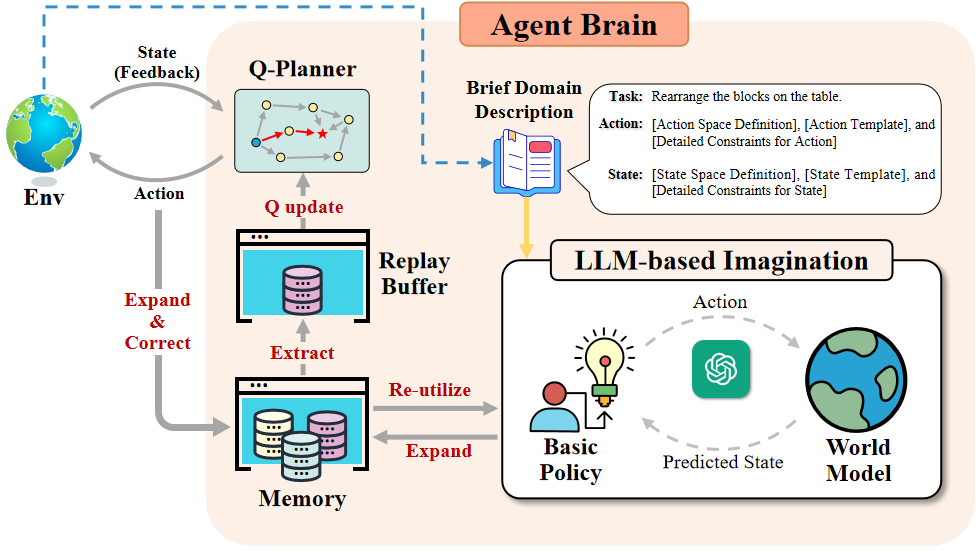

# Towards Optimal Long-Horizon Decision-Making by Model-based LLM Agent with Q-Planner
Codebase for paper: Towards Optimal Long-Horizon Decision-Making by Model-based LLM Agent with Q-Planner
 


<p align="center">
  [<a href="http://mlaq.site/">MLAQ Demo Website</a>]
  [<a href="https://drive.google.com/file/d/1xBjqhonLaOqYtkfssqq48WXkxzsJUWl7/view">Experimental Data</a>]
</p>


**Notice #1:** We recorded all the data during our experiments and stored it in [Google Drive](https://drive.google.com/file/d/1xBjqhonLaOqYtkfssqq48WXkxzsJUWl7/view). 

**Notice #2:** We provides a **demo website** for readers to better understand our work in [mlaq.site](http://mlaq.site). 

## Setup
### setup conda env and package install
```
conda create -n laq python=3.8 
conda activate laq
```
### Install mujoco and dm_control for RoCo benchmark
```
pip install mujoco==2.3.0
pip install dm_control==1.0.8 
```

### Install other packages
```
pip install -r requirements.txt
```

### Acquire OpenAI/Claude API Keys
In run_MLAQ.py, replace the following codes with your OpenAI API key and API base URL
```
OPENAI_KEY = str("your_openai_key_here")
os.environ["OPENAI_API_KEY"] = OPENAI_KEY
os.environ["OPENAI_BASE_URL"] = "your_openai_base_url_here"
openai.api_based = "your_openai_base_url_here"
openai.api_key = OPENAI_KEY
```

## Usage 
### Run MLAQ on the Blocksworld domain
You can change the blocksworld domain to other domains by changing the `--task` argument, including `blocksworld`, `sort_central`, `sort_dialog`, `sandwich_central`, and `sandwich_dialog`.
```
$ conda activate laq
(laq) $ python run_MLAQ.py --task blocksworld -llm gpt-4-0125-preview --skip_display --tree_load --optimal_steps=2 --start_run_id=0 --start_case_id=0
```

